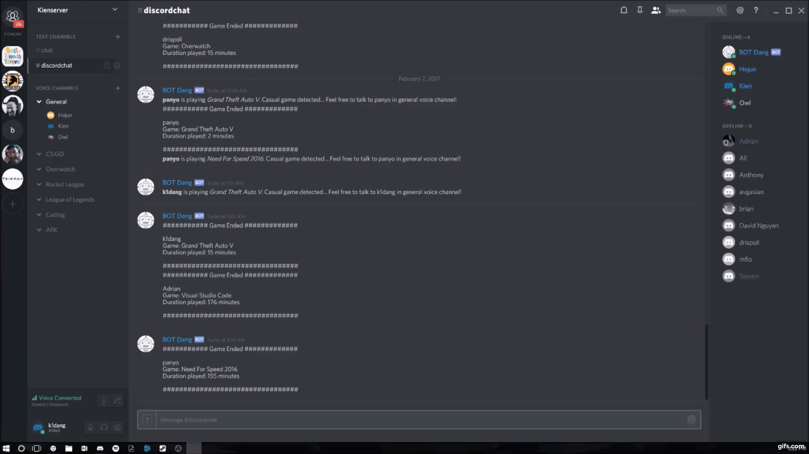

# PyDiscordBot
The BOT created is to organize members of a Discord channel using discord.py from [Rapptz](https://github.com/Rapptz/discord.py)

# Features 
* BOT recognizes changes in game state of users and alerts channel what game they are playing and what voice channel the user will be moved to
* Game End Stats showing the duration of the game played and how long the game was played for
- Clear function built in to clear all messages in current channel using the command `!clear`

# Demo

## Acknowledgements
Thanks to [Adrian](https://github.com/adrianlee) and [Shameel](https://github.com/meeoh/) for helping with debugging and guiding me in writing this bot.
